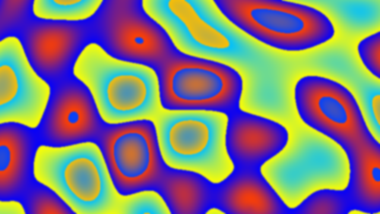

# Phaseflower

Make nice MP4 video loops.

Works well in [Anaconda](https://www.anaconda.com/)
but any well-stocked [SciPy](https://scipy.org/) install should do.

Author: [Todd Hartmann](https://github.com/ToddHartmann)\
License:  Public Domain, Use At Your Own Risk

## The Help
```
usage: phaseflower.py [-h] [-i I] [-o O] [-ic IC] [-oj OJ] [-n N] [-s S]
                      [-r R] [-ef EF] [-x X] [-y Y] [-z Z] [-cx CX] [-cy CY]

Make nice video loops.

optional arguments:
  -h, --help  show this help message and exit
  -i I        Input file
  -o O        Output file or directory
  -ic IC      File to load color info from
  -oj OJ      File to output JSON to and exit
  -n N        Number of thumbnails to make
  -s S        Length of movie in seconds (default 4), negative to go backwards
  -r R        Rate in frames per second (default 30)
  -ef EF      Number of extra frames to add or subtract (total = S * R + EF)
  -x X        Width in pixels (default 360)
  -y Y        Height in pixels (default 640)
  -z Z        Zoom (2=plane half size, .5=2x)
  -cx CX      Center x-coord in math
  -cy CY      Center y-coord in math

phaseflower                = make random png w/ default 640:360 zoom=1
phaseflower -n N           = make N random pngs
phaseflower -n N -o outdir = make N random pngs in outdir
phaseflower -y 1080        = make 1 random png w/ height=1080
phaseflower -s S           = make random movie S seconds long
phaseflower -r R           = make random movie w/ framerate R
phaseflower -s S -y 1080   = make random movie S seconds long and 1080 pixels high
phaseflower -i name.ext    = make movie from input file (.json, .mp4, or .png)
phaseflower -i waves.ext -ic color.ext
                    = make movie using waves from -i and colors from -ic
phaseflower -o outdir      = make random movie in outdir
phaseflower -o out.mp4     = make random movie in out.mp4
phaseflower -i name.ext -oj outname.json
                    = output the JSON to a file and exit
phaseflower -oj name.ext   = make a JSON file with random waves and colors

You cannot make thumbnails and movies at the same time.  Neither can
you make thumbnails and JSON at the same time (you get thumbnails),
nor JSON and movies at the same time (you get JSON).  Other than
those restrictions, you can combine almost all the options, the
exceptions are few and make sense.

The default aspect ratio is 16:9 if either -x or -y is missing.
```
## Examples

[simple.mp4](examples/simple2.mp4)\
[simple.json](examples/simple.json)
```
{
    "colorspace": "rgb",
    "coloroptions": [["red", "green", "blue"], [1, 1, 1], [false, false, false]],
    "wavelist":
    {
        "zoom": {"cx": 0.0, "cy": 0.0, "x": 512, "y": 512, "z": 1.0},
        "guid": "b911419e-54e5-4d8f-a758-d17df9d993fb",
        "waves":
        [
            {"amp": 0.999999, "cx": 0.0, "cy": 0.0, "exp": 1, "freq": 1, "phase": 0.0}
        ]
    }
}
```

<p style="text-align:center;"></p>